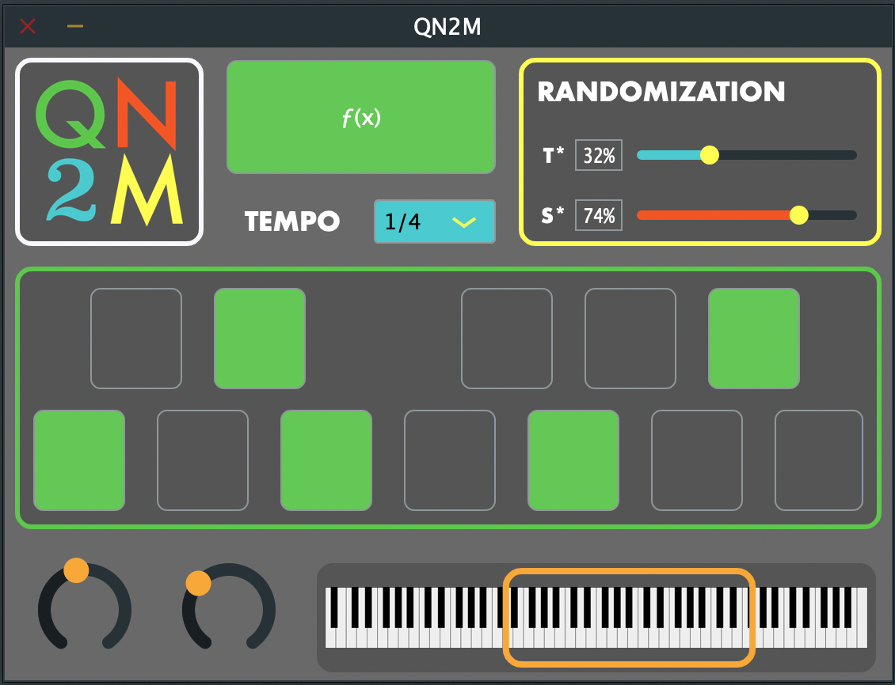
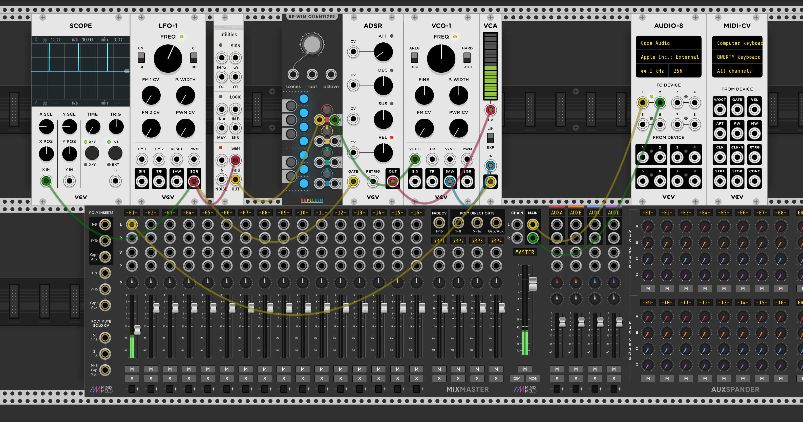

# QN2M

QN2M (Quantized Noise to Midi) is a Midi generating plugin. Users get to define a number of parameters that will control the pitch and tempo at which new midi notes are randomly drawn to their DAWs piano roll.  

	

## Inspiration

The inspiration for this project came from studying modular synthesis techniques over the duration of a semester. When sitting down to create new modular synthesis patches, I found myself often starting with a similar pattern of modules. This sequence of modules is illustrated below in VCVRack. We start with a clock (Square wave) that decides our tempo. That clock will control an ADSR envelope and a noise generator. We now get a new random value from the noise generator with every pulse of our clock. That random noise value gets quantized into a musical pitch based on a user defined scale. In this example we are quantizing these noise values to a C major scale. The ADSR controls the envelope of a VCO and voila! Endless music!

The example illustrated below actually sounds pretty terrible, but the idea can be built upon. I wanted to take this concept and use it with some of my favorite MIDI synth plugins in my DAW. Though QN2M doesn't actually create any sound, it can be used to create generative music with any MIDI synth. 

	

